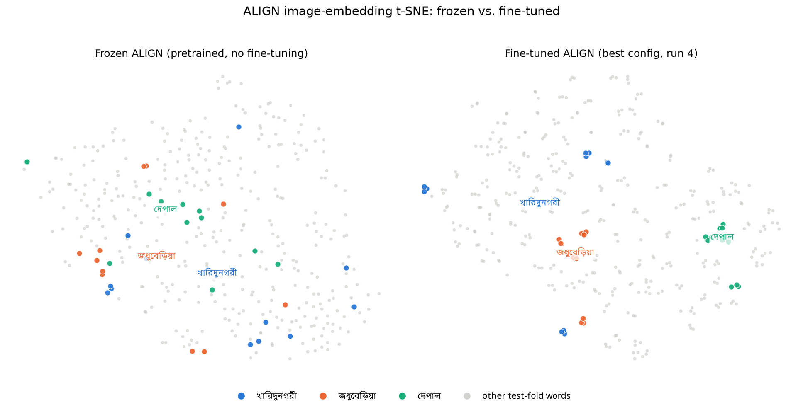

# Embedding visualization — results write-up

Script: `embedding_visualization.py`. t-SNE of ALIGN **image** embeddings only (no
text involved) on the same 384-image test fold used throughout, comparing frozen
(pretrained, no fine-tuning) `kakaobrain/align-base` against the best fine-tuned
ALIGN config (run 4). Output: `results/embeddings/tsne_frozen_vs_finetuned.png`.

## The plot

Three words are drawn in distinct colors (blue/orange/aqua); every other word is a
single muted gray "other" point. **Why only 3 named colors and not all 40 words**:
in a scatter plot any two points can end up next to each other, which is a much
harder colorblind-safety bar than a bar/line chart (where only *adjacent* series
need to stay distinguishable) — the documented default categorical palette only
clears that bar for its first 3 hues; past that, more hues stop being reliably
distinguishable and the usual practice is to fold the rest into "Other" rather than
pretend 40 arbitrary hues are all identifiable. The 3 chosen (খারিদুনগরী,
জধুবেড়িয়া, দেপাল) are the same 3 already discussed with concrete numbers in
`qualitative_writeup.md`, so a reader can cross-reference "here's where that word's
images actually live in embedding space."

Visually: in the frozen panel the 3 highlighted words' points are scattered fairly
loosely among the gray background; in the fine-tuned panel they pull into visibly
tighter, more separated clusters.

## Quantifying it (the plot alone would be misleading here)

My first attempt at a quantitative backup for "clusters got tighter" was mean
pairwise cosine similarity *within* each word's own images. That number actually
goes the **wrong way**: frozen ALIGN scores 0.791, fine-tuned scores 0.568 — i.e.
raw same-word similarity *drops* after fine-tuning, seemingly contradicting the
plot. This is a known artifact, not a real regression: pretrained embedding spaces
are commonly **anisotropic** — every embedding sits in a narrow cone of the
hypersphere, which inflates *every* pairwise similarity, same-word or not. A high
raw intra-class number there just means "everything looks similar to everything."

The number that actually matters for retrieval is the **separation margin** —
mean same-class cosine similarity minus mean different-class cosine similarity,
over the whole test set. Rank-based metrics (like task 1's QbE mAP) only depend on
relative ordering, so they're insensitive to a uniform shift in similarity level;
separation margin captures exactly that relative-ordering signal instead of the
misleading absolute level:

| model | intra-class mean | inter-class mean | **separation margin** |
|---|---:|---:|---:|
| frozen ALIGN (pretrained) | 0.791 | 0.728 | **0.063** |
| fine-tuned ALIGN (run 4) | 0.562 | 0.245 | **0.317** |

Fine-tuning lowers *both* intra- and inter-class similarity (the space de-anisotropizes,
spreads out over more of the hypersphere), but it lowers inter-class similarity far
more than intra-class — nearly **5× the separation margin** of the frozen model
(0.317 vs 0.063). That's the real, quantitative version of what the t-SNE plot
shows, and it lines up with task 1's finding that run 4 has strong QbE mAP (0.532)
— image-only retrieval benefits directly from this separation, independent of
whatever's going wrong on the text side (see `qualitative_writeup.md` for that).

Full per-word intra-class numbers: `results/embeddings/intra_class_similarity.csv`.
Frozen-vs-fine-tuned separation margin: `results/embeddings/separation_margin.csv`.

## Caveat

t-SNE coordinates from the two panels are **not on a shared scale** — each is an
independent fit, so absolute positions/distances aren't comparable across panels
(only within one panel). That's standard and expected for t-SNE; it's exactly why
the separation-margin table above (computed in the original embedding space, not
the t-SNE projection) is the number to cite, not eyeballed distances in the plot.

## Fixed along the way

Hardcoding the 3 highlight words directly in the script's source (by typing the
Bengali text) initially caused one of the three (জধুবেড়িয়া) to silently match
zero points — the typed string and the dataset's version of the same word are
different Unicode representations of visually-identical text (precomposed vs.
decomposed combining characters), so plain `==` comparison failed. Fixed with
`unicodedata.normalize('NFC', ...)` on both sides before matching. Worth knowing
about if any other script ever compares a manually-typed Bengali string against
data-derived strings.
